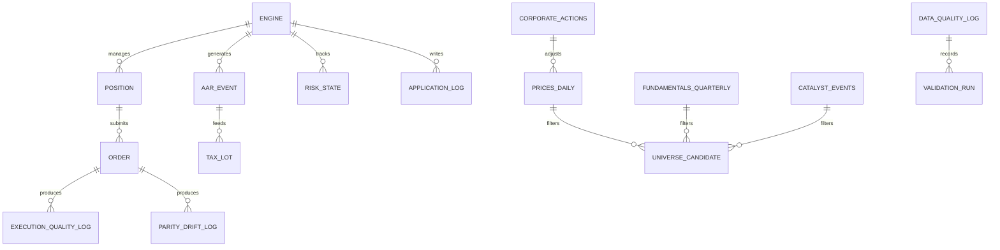
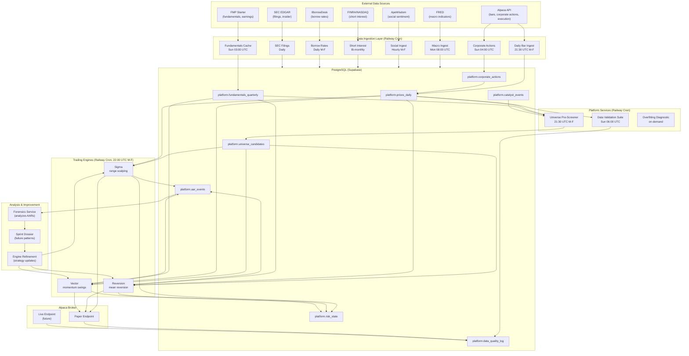
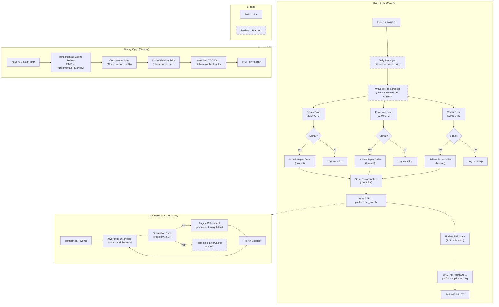

## 2. Database Schema

### 2.1 Entity-Relationship Diagram (Mermaid)



### 2.2 Detailed Table Definitions

List every table under the `platform` schema. For each, provide columns, types, constraints, and a one-line purpose.

#### `platform.prices_daily`

**Purpose:** Canonical daily OHLCV bars. Survivorship-free (Alpaca SIP `all_active` sweep + Tradier wide-export merge; default feed switched IEX→SIP on 2026-05-13 — IEX silently missed tickers that trade off-IEX). Backtests query directly; live engines query via `PostgresDataAdapter`. As of 2026-05-14: **20,654,889 rows** across **7,694 distinct tickers** spanning 1994-07-21 → today.

**Columns:**

- `ticker` (text, PK): Stock symbol.
- `date` (date, PK): Trading day.
- `open`, `high`, `low`, `close` (numeric): Price bars.
- `volume` (bigint): Daily volume.
- `adjusted_close` (numeric): Split- and dividend-adjusted close.
- `delisted` (boolean, default false): True if the ticker was delisted.
- `delisting_date` (date, nullable): Date of delisting.
- `source` (text): `'alpaca'` or `'tradier'`.
- `recorded_at` (timestamptz, default `now()`): Ingestion timestamp.

**Indexes:** `(ticker, date)` unique; `(date)` for range scans.

**AI Rules:** Always filter `WHERE date >= start AND date <= end`. Never query without a date range.

#### `platform.fundamentals_quarterly`

**Purpose:** Point-in-time quarterly fundamentals (FMP Starter). Used by Reversion for earnings-quality gate and Vector for Gate 1 (P/B, D/E). As of 2026-05-14: **178,608 rows** across **5,984 tickers** (post-Phase-1 backfill); `pb` + `de` populated on 152,907 rows (~85%), the rest are explainable NULLs (negative book value, no price on filing date, missing balance/share fields). `compute_fundamental_ratios.py` writes both ratios with a single set-based UPDATE; degenerate FMP rows (`total_assets=0`, `total_liabilities<0`) are rejected up front. Adapter (`tpcore/fmp/fundamentals_adapter.py`) uses centralized `@with_retry` (Phase 2 of adapter normalization, 2026-05-14) — `tenacity` dependency removed.

**Columns:**

- `ticker` (text, PK): Stock symbol.
- `filing_date` (date, PK): SEC filing date (PIT-safe boundary).
- `period_end_date` (date): Fiscal quarter end.
- `revenue`, `net_income`, `fcf` (numeric): Core financials.
- `total_assets`, `total_liabilities` (numeric): Balance sheet.
- `current_assets`, `current_liabilities` (numeric): Liquidity.
- `shares_outstanding` (numeric): For per-share calculations.
- `pb` (numeric, nullable): Computed price-to-book.
- `de` (numeric, nullable): Computed debt-to-equity.
- `recorded_at` (timestamptz, default `now()`).

**Indexes:** `(ticker, filing_date)` unique.

**AI Rules:** Always filter `WHERE filing_date <= :as_of_date` for point-in-time safety. Never use `period_end_date` alone for PIT queries.

#### `platform.corporate_actions`

**Purpose:** Splits and dividends from Alpaca's free `/v2/corporate_actions` endpoint. Applied to `prices_daily` weekly.

**Columns:**

- `ticker` (text): Stock symbol.
- `action_date` (date): Effective date.
- `action_type` (text): `'split'` or `'dividend'`.
- `ratio` (numeric): For splits, new/old (e.g., 4.0 for 4:1). For dividends, per-share amount.
- `raw_data` (jsonb): Full Alpaca response for audit.
- `recorded_at` (timestamptz, default `now()`).

**Indexes:** `(ticker, action_date, action_type)` unique.

#### `platform.catalyst_events`

**Purpose:** Earnings beats (FMP Starter). Used by Vector Gate 2 and future Catalyst engine.

**Columns:**

- `ticker` (text): Stock symbol.
- `event_date` (date): Earnings announcement date.
- `event_type` (text): `'EARNINGS_BEAT'` (only type for MVP).
- `magnitude_pct` (numeric): `(actual - estimated) / estimated`.
- `recorded_at` (timestamptz, default `now()`).

**Indexes:** `(ticker, event_date)` unique.

#### `platform.tradier_options_chains`

**Purpose:** Options chain snapshot from Tradier (May 2026). Frozen — parked for future S2 engine.

**Columns:**

- `ticker` (text): Underlying symbol.
- `expiration_date` (date): Option expiration.
- `strike` (numeric): Strike price.
- `option_type` (text): `'CALL'` or `'PUT'`.
- `bid`, `ask`, `last` (numeric): Quote data.
- `volume`, `open_interest` (integer): Activity.
- `retrieved_at` (timestamptz): Snapshot timestamp.

**AI Rules:** This table is frozen. Do not write to it.

#### `platform.universe_candidates`

**Purpose:** Pre-screened candidates per engine, refreshed daily. Engines read from this table instead of using hardcoded lists. The table answers "what's in scope today" — engines compute their own scores at runtime, so there is **no `score` column**. V1 populates only `engine='momentum'`; Sigma/Reversion/Vector keep their hardcoded universes until they need this.

**Columns:**

- `as_of_date` (date, PK): Screening date.
- `engine` (text, PK): `'momentum'` today; future engines opt in by adding a populator to `tpcore.universe.prescreener`.
- `ticker` (text, PK): Stock symbol.
- `tier` (smallint, nullable): Liquidity tier (1–5) at selection time. Null if the engine doesn't gate on tier.
- `last_close` (numeric(18,6), nullable): Close used for the tradability check.
- `reason` (text, nullable): Optional rationale.
- `created_at` (timestamptz, default `now()`).

**Indexes:** PK `(as_of_date, engine, ticker)`; secondary `idx_uc_engine_date (engine, as_of_date)` for scheduler reads.

**Populator:** `tpcore.universe.prescreener.prescreen_momentum` (run daily after the prices_daily ingest). Joins `liquidity_tiers` (tier ≤ 2) against the latest close in `prices_daily` and applies `momentum.models.is_tradeable_common_stock`.

**AI Rules:** Upsert via `ON CONFLICT (as_of_date, engine, ticker) DO UPDATE`. Historical rows are kept — don't delete prior dates.

#### `platform.aar_events`

**Purpose:** Unified after-action reports for every trade, paper or live. Fed by `tpcore.aar.AARWriter`.

**Columns:**

- `id` (uuid, PK): Unique row identifier.
- `engine` (text): `'sigma'`, `'reversion'`, `'vector'`.
- `trade_id` (text): Engine-assigned trade identifier.
- `ticker` (text): Stock symbol.
- `aar_data` (jsonb): Full `AfterActionReport` model serialized.
- `recorded_at` (timestamptz, default `now()`).

**Indexes:** `(engine, trade_id)` unique.

**AI Rules:** Use `INSERT ... ON CONFLICT (engine, trade_id) DO NOTHING`. The `aar_data` column is jsonb — query with `aar_data->>'field_name'`.

#### `platform.execution_quality_log`

**Purpose:** Fill quality per order. Populated by `tpcore.quality.ExecutionQualityWriter`.

**Columns:**

- `source` (text): `'execution_quality'`.
- `timestamp` (timestamptz).
- `slippage_bps` (numeric): Signed basis points (positive = unfavorable).
- `fill_price` (numeric): Actual fill price.
- `paper_or_live` (text): Execution environment.
- `notes` (jsonb): Full `ExecutionQualityScore` model.

#### `platform.data_quality_log`

**Purpose:** Multi-purpose quality log. Receives rows from the Data Validation Suite, execution quality tracker, and credibility scorer.

**Columns:**

- `source` (text): `'validation.delistings'`, `'validation.constituent'`, `'validation.splits'`, `'execution_quality'`, `'backtest_credibility.<engine>'`, `'quotes_crosscheck_tradier_alpaca'`.
- `timestamp` (timestamptz).
- `latency_ms` (integer): Check duration.
- `missing_bars` (integer): Repurposed — count of failures for validation checks.
- `stale` (boolean): True if the check failed.
- `confidence` (numeric): Fraction of entries that passed.
- `notes` (jsonb): Detailed failure list or diagnostic output.

#### `platform.parity_drift_log`

**Purpose:** Paper-vs-live fill drift. Populated by `LivePaperParityHarness` when a live broker is provisioned.

**Columns:**

- `client_order_id` (text): Order identifier.
- `paper_fill_price` (numeric): Paper fill.
- `live_fill_price` (numeric, nullable): Live fill (null until live broker active).
- `drift_bps` (numeric): Signed basis points.
- `paper_filled_at` (timestamptz): Paper fill timestamp.
- `live_filled_at` (timestamptz, nullable): Live fill timestamp.
- `spread_at_order_pct` (numeric, nullable): Median spread observed for the ticker at order-submission time, snapshotted from `platform.spread_observations`. Added by migration `20260512_2200_parity_drift_log_spread_columns.py` so drift can be attributed to liquidity tier vs other factors.
- `spread_observed_at` (timestamptz, nullable): Timestamp of the spread observation snapshotted above.
- `timestamp` (timestamptz, default `now()`).

#### `platform.open_orders`

**Purpose:** Working state for live orders between submission and terminal status. Populated by the trade monitor (`tpcore.trade_monitor`) when it sees an Alpaca `trade_updates` event. Used by engine schedulers to reconcile open positions across cron invocations.

Created by migration `20260512_0000_create_open_orders.py`.

**Columns:**

- `id` (uuid, PK).
- `engine` (text): originating engine (`'sigma'` / `'reversion'` / `'vector'` / `'momentum'`).
- `trade_id` (text): engine-local trade identifier.
- `ticker` (text).
- `order_type` (text): `'tier1'` / `'tier2'` / `'momentum_rebalance'` etc.
- `alpaca_order_id` (text, nullable): broker's order ID.
- `status` (text): `'new'` / `'accepted'` / `'partially_filled'` / `'filled'` / `'canceled'` / `'rejected'`.
- `fill_price` (numeric, nullable).
- `filled_at` (timestamptz, nullable).
- `decision_data` (jsonb): the originating `ExecutionDecision` / `RebalanceOrder` payload, for audit.
- `created_at` (timestamptz, default `now()`).
- `updated_at` (timestamptz, default `now()`).

#### `platform.spread_observations`

**Purpose:** Per-ticker spread estimates that feed `platform.liquidity_tiers`. The Corwin-Schultz bootstrap (`tpcore.backtest.spread_estimator.rank_universe_by_liquidity`) writes one row per ticker per run with `source='corwin_schultz'`. Tradier streaming was the planned second source but was deprecated 2026-05-12.

Created by migration `20260512_2100_spread_observations_and_liquidity_tiers.py`.

**Columns:**

- `id` (bigserial, PK).
- `ticker` (text).
- `source` (text): currently only `'corwin_schultz'`; future sources extend the `WHERE source IN (...)` filter in `assign_liquidity_tiers.py`.
- `spread_pct` (numeric): median estimated round-trip spread as a fraction (0.0010 = 10 bps).
- `n_observations` (integer): how many daily H/L pairs went into the estimate.
- `observed_at` (timestamptz): when the bootstrap ran.

#### `platform.liquidity_tiers`

**Purpose:** Per-ticker tier assignment derived from `spread_observations`. The cost model (`tpcore.backtest.cost_model.get_round_trip_cost`) looks each ticker up here; unknown tickers fall through to the T4 default (1.50% round-trip).

Created by migration `20260512_2100_spread_observations_and_liquidity_tiers.py`. Re-aggregated by `scripts/assign_liquidity_tiers.py` (wrapped in `scripts/run_tier_refresh.sh`).

**Tier thresholds** (median spread upper bound, exclusive):

| Tier | Median spread ≤ | Round-trip cost band | Universe size (2026-05-12) |
|---|---|---|---|
| T1 | 0.0005 (5 bps) | tightest | 702 |
| T2 | 0.0015 (15 bps) | very liquid | 579 |
| T3 | 0.0050 (50 bps) | mid-cap-ish | 1,405 |
| T4 | 0.0200 (200 bps) | **default** for unknowns | 3,692 |
| T5 | > 0.0200 | widest spreads | 1,180 |

**Columns:**

- `ticker` (text, PK).
- `tier` (smallint, 1-5): assigned tier.
- `median_spread_pct` (numeric).
- `p95_spread_pct` (numeric): 95th percentile across the source's observations.
- `observations` (integer): aggregate observation count.
- `provisional` (boolean, default false): true when fewer than 5 observations are pooled (e.g., brand-new IPOs).
- `last_updated` (timestamptz, default `now()`).

#### `platform.ticker_classifications`

**Purpose:** Asset-class taxonomy for every ticker in the platform — distinguishes `stock` / `etf` / `spac` / `fund` so catalyst validation, sentinel-engine basket selection, and the dashboard tier panel can filter / classify correctly. Backfilled 2026-05-14 from Alpaca `/v2/assets` plus a name-pattern classifier; **13,669 rows** at backfill.

**Columns:**

- `ticker` (text, PK).
- `asset_class` (text, NOT NULL): one of `'stock'`, `'etf'`, `'spac'`, `'fund'`.
- `etf_inverse` (boolean, nullable): true for inverse ETFs (SH, PSQ, SQQQ, etc.). NULL for non-ETF rows.
- `etf_leverage` (numeric, nullable): leverage factor (e.g., `3.0` for TQQQ, `-2.0` for SQQQ). NULL for non-ETF or 1x ETFs.
- `etf_category` (text, nullable): rough family (`'equity_broad'`, `'bond_treasury'`, `'commodity_gold'`, …) for the sentinel engine's basket selection.
- `source` (text): `'alpaca_assets'` or `'name_pattern_fallback'`.
- `recorded_at` (timestamptz, default `now()`).

**Used by:**

- `catalyst_freshness` validation check (skip ETFs and funds from earnings-event freshness assertions).
- Sentinel engine (planned) — inverse / leverage / category filters for the macro-inverse basket.
- Dashboard liquidity-tier filtering (so an ETF doesn't show up labelled as "missing fundamentals").

**Maintenance:** `scripts/classify_tickers.py` re-runs the classifier; the operator runs it after a universe expansion. No daily refresh required — asset-class taxonomy is near-static.

#### `platform.ingestion_jobs`

**Purpose:** Persistent job registry consumed by the `ingestion-engine` service (Railway service definition in `railway.json:58`). Each row describes a recurring ingestion task (daily bars, corporate actions, fundamentals refresh, etc.) — the engine reads the registry on each tick and dispatches due jobs to handlers in `tpcore.ingestion.handlers`.

Used today by `ops/ingestion_engine.py` (Railway-deployed when active) and as the source of truth for which jobs `scripts/ops.py --update` invokes locally.

**Columns:** (verify against the actual migration before quoting verbatim — the registry has evolved through several migrations)

- `id` (uuid, PK).
- `job_name` (text, unique): canonical identifier (`'daily_bars'`, `'corporate_actions'`, `'fundamentals_refresh'`, `'data_validation'`, `'universe_simulation'`).
- `schedule` (text): cron expression (or `null` for on-demand-only jobs).
- `enabled` (boolean, default true).
- `last_run_at` (timestamptz, nullable).
- `last_status` (text, nullable): `'OK'` / `'FAILED'` / `'TIMEOUT'` / `'SKIPPED'` / `'DRY_RUN'`.
- `config` (jsonb): handler-specific parameters (universe selector, lookback days, etc.).

#### `platform.risk_state`

**Purpose:** Per-engine risk governor state. Persists daily/weekly P&L and kill-switch flag across Railway cron invocations.

**Columns:**

- `engine` (text, PK): `'sigma'`, `'reversion'`, `'vector'`.
- `daily_pnl` (numeric): Cumulative P&L for the current trading day.
- `weekly_pnl` (numeric): Cumulative P&L for the current trading week.
- `kill_switch_active` (boolean, default false): If true, engine refuses to submit orders.
- `kill_switch_reason` (text, nullable): Why the kill switch was tripped.
- `open_positions` (integer, default 0): Current position count.
- `last_updated` (timestamptz, default `now()`).

**AI Rules:** Always use `INSERT ... ON CONFLICT (engine) DO UPDATE`. Never delete rows from this table.

#### `platform.allocations`

**Purpose:** One row per allocator decision per engine. Audit trail for the weekly inverse-volatility rebalance.

**Columns (current):** `id`, `engine`, `decided_at`, `weight`, `allocated_capital`, `prior_equity`, `realized_vol`, `freeze_state` (`active` / `soft_frozen` / `hard_frozen`), `freeze_reason`, `drawdown_pct`.

**Written by:** `tpcore.allocator.AllocatorService` (daemon: `com.michael.trading.allocator`, fires Mondays 13:00 UTC).

**Read by:** Operator dashboard's Allocator panel + spot-checks via SQL.

#### `platform.forensics_triggers`

**Purpose:** One row per detection event (drawdown period, loss cluster, outlier loss). Surfaces patterns in the AAR history that warrant an operator-driven Sprint Dossier.

**Columns:** `id`, `trigger_kind` (`outlier_loss` / `loss_cluster` / `drawdown_period`), `payload` (jsonb — engine, trade_id(s), σ/drawdown specifics, **`fingerprint`** for idempotency, **`dossier_path`** pointing at the auto-generated markdown postmortem), `fired_at`, `resolved_at` (NULL until operator resolves via dashboard).

**Written by:** `tpcore.forensics.ForensicsService` (runs as the final step of `scripts/run_post_close.sh`).

**Read by:** Operator dashboard's Health → Forensics expander (with one-click resolve button).

#### `platform.tax_lots` (planned)

**Purpose:** FIFO tax lot tracking for the Tax Overlay. Schema deferred.

#### `platform.application_log`

**Purpose:** Rolling 7-day audit trail for every scheduler run. Each invocation tags rows with a per-run UUID so the timeline of one run is queryable. Stdout is the live Railway view; this table is the queryable archive. Populated by `tpcore.logging.DBLogHandler`; retention is enforced on every write — see AI Rules below.

**Columns:**

- `id` (uuid, PK, default `gen_random_uuid()`): Unique row identifier.
- `engine` (text): `'sigma'`, `'reversion'`, `'vector'`.
- `run_id` (uuid): Unique per scheduler invocation.
- `event_type` (text): `'STARTUP'`, `'SCAN_COMPLETE'`, `'SIGNAL'`, `'ORDER_SUBMITTED'`, `'FILL_CONFIRMED'`, `'ERROR'`, `'SHUTDOWN'`.
- `severity` (text): `'INFO'`, `'WARNING'`, `'ERROR'`, `'CRITICAL'`.
- `message` (text): Human-readable.
- `data` (jsonb, nullable): Structured payload (tickers, scores, order IDs, error tracebacks).
- `recorded_at` (timestamptz, default `now()`).

**Indexes:** `(engine, run_id, recorded_at)`.

**AI Rules:** Never query without filtering on `run_id` or `recorded_at` — the table is small by design but unbounded growth is the recurring failure mode for audit logs. The handler issues `DELETE FROM platform.application_log WHERE recorded_at < now() - INTERVAL '7 days'` after every insert; do not add a separate retention cron. To inspect a run's timeline: `SELECT recorded_at, event_type, severity, message, data FROM platform.application_log WHERE run_id = $1 ORDER BY recorded_at`.

## 3. Dataflow Specification

### 3.1 System-Level Flow Diagram (Mermaid)



### 3.2 Ingestion Flow Detail

**Trigger:** Railway cron services fire on schedule. Each ingestion script is idempotent (re-running produces the same result).

- **Daily Bar Ingest (21:30 UTC Mon-Fri):** Pulls latest bars from Alpaca for all active tickers. Upserts into `platform.prices_daily`. Engines never call Alpaca for bars — they query this table via `PostgresDataAdapter`.
- **Corporate Actions (Sun 04:00 UTC):** Pulls split/dividend events from Alpaca → `platform.corporate_actions`. Applies adjustments to `platform.prices_daily` via `apply_splits.py`.
- **Fundamentals Cache Refresh (Sun 03:00 UTC):** Pulls latest quarterly filings from FMP → `platform.fundamentals_quarterly`. The `FundamentalsCache` wrapper serves engines with DB-first, FMP-fallback logic.
- **Macro Ingest (Mon 08:00 UTC):** Pulls Sahm Rule, PMI, claims, yield curve from FRED → `platform.macro_indicators`. Used by Sentinel engine (future).
- **Social Ingest (Hourly M-F):** Pulls Reddit/StockTwits sentiment from ApeWisdom → `platform.social_signals`. Used by S2 engine (future).
- **Short Interest (Bi-monthly):** Pulls FINRA/NASDAQ short interest data → `platform.short_interest`. PIT-safe: release-date matched.
- **Borrow Rates (Daily M-F):** Scrapes IBorrowDesk → `platform.borrow_rates`. Fragile; circuit breaker active.
- **SEC Filings (Daily):** Pulls 10-K, 10-Q, 8-K, Form 4 from SEC EDGAR → `platform.filings_insider`. Used by Vector catalyst detection and S2 insider check.

### 3.3 Engine Execution Flow

**Trigger:** Railway cron services fire at 22:00 UTC Mon-Fri, 30 minutes after the Universe Pre-Screener completes.

1. **Startup:** Scheduler creates asyncpg pool. Reads `platform.risk_state` for kill-switch status. Refuses to run if kill switch is active or database is unreachable.
2. **Universe Selection:** Queries `platform.universe_candidates WHERE engine = $1 AND as_of_date = CURRENT_DATE`. Falls back to hardcoded list if table is empty (transitional).
3. **Setup Detection:** Plug queries `platform.prices_daily` via `PostgresDataAdapter` for daily bars. Computes engine-specific scores. Returns ranked candidates.
4. **Lifecycle Analysis:** For each candidate above threshold, determines phase (SETUP, ACTIVE, EXHAUSTED). Applies engine-specific gates (earnings quality, CHOP, catalyst proximity).
5. **Execution & Risk:** Computes position size. Calls `RiskGovernor.check_trade()`. Submits bracket orders to Alpaca paper endpoint. Records fill quality.
6. **AAR Logging:** On Tier 1 and Tier 2 fills, writes `AfterActionReport` to `platform.aar_events` via `AARWriter`.
7. **Shutdown:** Updates `platform.risk_state` with cumulative P&L. Writes a `SHUTDOWN` event to `platform.application_log` (the canonical health indicator for short-lived runs). Closes pool. Exits.

### 3.4 Backtesting Flow

- **Data Loading:** Reads `platform.prices_daily`, `platform.fundamentals_quarterly`, `platform.catalyst_events`, `platform.corporate_actions` directly. No external APIs.
- **Trade Simulation:** Identical engine logic. Fills simulated at next open. Transaction cost model: 0.05% slippage per side.
- **Output:** Per-trade CSV → `backtests/<engine>_trades.csv`. Overfitting report → `backtests/<engine>_overfitting_report.json`. Credibility score → `platform.data_quality_log`.

### 3.5 AAR Feedback Loop

**Purpose:** The platform learns from every trade. AARs are not just a record—they are the input to the engine improvement cycle.

1. **AAR Generation:** On every Tier 1 and Tier 2 fill, the engine's AAR Logging Plug constructs an `AfterActionReport` and writes it to `platform.aar_events` via `tpcore.aar.AARWriter`.
2. **Forensics Analysis:** The Forensics service (master plan §5, deferred) monitors `platform.aar_events` across all engines. It triggers on:
   - **Drawdown Trigger:** Engine's 20-day cumulative P&L ≤ −10%.
   - **Loss Cluster Trigger:** Three consecutive losing trades.
   - **Extreme Loss Trigger:** A single trade loses more than 2× the engine's average loss.
3. **Sprint Dossier:** When a trigger fires, Forensics compiles a dossier containing the affected trades, market context at entry, rule-compliance checks, and a plain-language summary. The dossier is written to `platform.forensics_triggers` and flagged for review.
4. **Engine Refinement:** The development team (or Wizard) reviews the dossier, identifies the root cause, and applies a patch:
   - Parameter adjustment (e.g., tightening Z-score threshold).
   - Gate modification (e.g., adding a new filter).
   - Strategy redesign if the edge has decayed.
5. **Re-validation:** After changes, the engine's backtest is re-run and the overfitting diagnostics are updated. The engine resumes paper trading with the revised settings.

**Current state (2026-05-14):** Forensics is **built and wired into the post-close pipeline** (`tpcore/forensics/`). It runs as the final step of `scripts/run_post_close.sh` and emits trigger rows for drawdown periods, loss clusters, and outlier losses. Each new trigger auto-generates a Sprint Dossier template under `docs/sprints/<date>-<kind>-<engine>-<id>.md` with the trigger payload pre-filled — the operator's job is to write the Hypothesis + Fix sections, ship the change, and mark resolved via the dashboard. Both Forensics and Allocator read AARs through the shared `tpcore.aar.AARReader`.

### 3.6 Process Flow — Daily Trading Cycle



- **Daily Cycle:** Bar ingestion at 21:30 UTC, Universe Pre-Screener at 21:30 UTC, engine scans at 22:00 UTC. Signals generate orders; fills are reconciled and logged. The `SHUTDOWN` row in `platform.application_log` confirms successful completion — that table is the sole health indicator for short-lived cron runs.
- **Weekly Cycle:** Fundamentals cache refresh (Sun 03:00), corporate actions ingest + split application (Sun 04:00), Data Validation Suite (Sun 06:00).
- **AAR Feedback Loop:** Every fill writes an AAR. The overfitting diagnostic module (live) gates graduation at credibility ≥ 60/100. Failures drive engine refinement and backtest re-runs. The Forensics service and Sprint Dossier generation (planned, master plan §5) will further consume AAR data for automated failure analysis.

## 4. AI Implementation Rules

This section is binding for all AI coding sessions. Violating any rule is a hard failure.

### 4.1 Data Access

- **Source of truth:** `platform.prices_daily` is the sole source of price data for all engines and backtests. Never call Alpaca, FMP, or any external API for bars from within an engine or backtest script.
- **Point-in-time:** All fundamental queries must filter `WHERE filing_date <= :as_of_date`. Never use `period_end_date` alone.
- **Fail-closed:** If the database is unreachable, the engine must halt with a critical log and non-zero exit. No silent fallback to external APIs.
- **Idempotency:** All writes use `INSERT ... ON CONFLICT DO NOTHING` or `ON CONFLICT DO UPDATE`. Every ingestion script is safe to re-run.

### 4.2 Schema

- **No new tables without an Alembic migration.** All migrations live in `platform/migrations/versions/`.
- **All timestamps are `timestamptz` in UTC.** Application code must use `datetime.now(UTC)`.
- **Money is `Decimal`, quantities are `int`.** Never `float` for prices, sizes, or P&L in production code. Backtest scripts are exempt.
- **Every table has a `recorded_at` column** defaulting to `now()` for audit trails.

### 4.3 Performance

- **Batch queries:** When scanning multiple tickers, use `WHERE ticker = ANY($1::text[])` with a list parameter — never a loop of individual queries.
- **Date ranges are mandatory:** Every query against `prices_daily` must include `WHERE date >= $1 AND date <= $2`. Full table scans are prohibited.
- **Connection pools:** Schedulers create one pool at startup and reuse it for the entire run. The pool is closed before exit. No connection leaks.

### 4.4 Security

- **Secrets are never hardcoded.** All credentials come from environment variables (`.env` locally, Railway dashboard in production).
- **No raw text storage.** Reddit/StockTwits text is purged after analysis. Only summary metrics are persisted.
- **Personal-use scope.** The platform protects one operator. Multi-operator or commercial use is blocked.

### 4.5 Naming

- **Engine names:** `sigma`, `reversion`, `vector`, `s2`, `catalyst`, `sentinel`. No deprecated names (Creeper, Swinger, Grifter, Fader).
- **Score names:** `sigma_score` (or `fade_score` for Reversion, `swing_score` for Vector, `squeeze_score` for S2).
- **Database schemas:** All operational tables are in the `platform` schema. Alembic tracks migrations in `platform` schema.
- **File naming:** Backtest scripts at `<engine>/backtest.py`. Plugs at `<engine>/plugs/<plug_name>.py`. Tests at `<engine>/tests/test_<module>.py`.

### 4.6 Error Handling

- **Fail loud.** Never `except Exception: pass`. Log the error, increment the outage counter, and exit non-zero if the error is critical.
- **Circuit breakers:** For external API calls (FMP, IBorrowDesk, ApeWisdom), 5 consecutive failures trigger a 6-hour pause.
- **Run audit trail.** Every scheduler / cron emits `STARTUP` and `SHUTDOWN` rows to `platform.application_log` via `tpcore.logging.DBLogHandler`. The presence of a paired `STARTUP` + `SHUTDOWN` (with `exit_code = 0`) per `run_id` is the run-success signal; Railway's dashboard provides deployment status. External ping services are no longer used.

## 5. Implementation Queue

Tables and services that are specified but not yet built:

| Priority | Component | Status |
| ---: | --- | --- |
| 1 | Daily bar ingestion cron | Not built — bars not pre-fetched to `prices_daily` |
| 2 | `platform.macro_indicators` + FRED adapter | Not built |
| 3 | `platform.social_signals` + ApeWisdom adapter | Not built |
| 4 | `platform.short_interest` + FINRA adapter | Not built |
| 5 | `platform.borrow_rates` + IBorrowDesk adapter | Not built |
| 6 | `platform.filings_insider` + SEC EDGAR adapter | Not built |
| 7 | `platform.tax_lots` + Tax Overlay | Schema deferred |

**Done (kept here for grep history):** `PostgresDataAdapter` (commit `d75076d`, 2026-05-10) — engines now read bars from `platform.prices_daily` exclusively, no live-API fallback. `platform.application_log` + `tpcore.logging.DBLogHandler` (commit `ff468de` + Alembic `20260511_0100`, applied 2026-05-10) — every scheduler run emits a queryable timeline; 7-day retention enforced per-write. Fundamentals cache weekly refresh (`ops/cron_fundamentals_refresh.py` + `FundamentalsCache.backfill_all`, Railway service `fundamentals-refresh-scheduler` cron `0 3 * * SUN`, applied 2026-05-10) — every distinct active ticker in `prices_daily` has its FMP fundamentals refreshed weekly so the lazy cache never serves stale data. `platform.universe_candidates` + Universe Pre-Screener (`tpcore.universe.prescreener.prescreen_momentum` + Alembic `20260513_1237`, applied 2026-05-13) — daily-refreshed per-engine candidate roster; momentum's `setup_detection._load_universe` reads it with a `liquidity_tiers` fallback when empty; V1 populates only `engine='momentum'`. Allocator service + `platform.allocations` extension (Alembic `20260514_0000`, deployed 2026-05-13) — inverse-vol weighting, soft/hard freeze, weekly daemon. Forensics service + Sprint Dossier auto-generation (`tpcore/forensics/`, deployed 2026-05-14) — drawdown/cluster/outlier triggers wired into post-close + dashboard with one-click resolve; both Allocator and Forensics read AARs via the shared `tpcore.aar.AARReader`.

---

## 6. Data-Layer Hardening (2026-05-13)

The data layer underwent a major cleanup and self-healing refactor on 2026-05-13. Operators reading this doc post-cleanup should know:

### 6.1 Validation suite — now 7 checks (was 3)

`tpcore.quality.validation.suite.run_suite` runs every `--update` stage 5. Each check returns a `CheckResult` and persists one row to `platform.data_quality_log`:

| Check | Scope |
|---|---|
| `delistings` | known-bankruptcy fixture vs prices_daily.delisted flag |
| `constituent` | S&P 500 membership fixture vs prices_daily |
| `splits` | fixture split-day close-ratio in `[0.85, 1.15]` |
| **`row_integrity`** (NEW) | every prices_daily row: `close > 0`, `close <= 100M`, OHLC consistent (`high >= GREATEST(open, close, low)`, `low <= LEAST(open, close, high)`), non-NULL OHLCV, no future dates |
| **`fundamentals_integrity`** (NEW) | every fundamentals_quarterly row: `period_end_date <= filing_date`, `shares_outstanding > 0 OR NULL`, no future filings |
| **`corporate_actions_integrity`** (NEW) | every corp_actions row: `ratio` in `(0, 1000]`, no NULL action_type, no far-future dates |
| **`catalyst_freshness`** (NEW 2026-05-14) | `catalyst_events.max(event_date)` not older than 7 days for the active T1+T2 universe; warns on stale (drives the `catalyst_refresh` stage's skip-guard) |

Acceptance: `passed=True` on all 7 + `confidence=1.000`. Cleanup scripts exist for each predicate (see `scripts/cleanup_*.py`).

### 6.2 `--update` pipeline now 9 stages

```
daily_bars → corporate_actions → coverage_fill → cross_ref_cleanup → fundamentals_refresh
→ catalyst_refresh → data_validation → universe_prescreener → universe_simulation
```

* **`coverage_fill`** (added 2026-05-13) self-heals tier ≤ 2 ticker gaps via Alpaca SIP, 14-day window, after every daily_bars run.
* **`cross_ref_cleanup`** (added 2026-05-13) deletes expired `tradier_options_chains` rows + orphan-ticker rows across dependent tables — keeps the dashboard cross-table integrity panel green.
* **`fundamentals_refresh`** is skip-if-refreshed-within-24h — resumable across timeouts.
* **`catalyst_refresh`** (added 2026-05-14) backfills FMP earnings-beat events for the T1+T2 universe. Skip-guard: short-circuits in ~10ms when `catalyst_events` was refreshed within 6 days. Resolves Vector's "data-blocked" state.
* **`daily_bars`** idempotent: checks count for the most-recent closed session; skips if ≥6,500 tickers already present.
* Each stage emits `INGESTION_START` / `INGESTION_COMPLETE` / `INGESTION_FAILED` events with `data->>'stage'` set and writes to `platform.ingestion_jobs.last_run_at` on completion. Failed stages auto-retry once if the error class is transient (timeout, ReadError, 429). Underlying HTTP fetchers use `tpcore.outage.with_retry` so transient 429/5xx is handled centrally.

### 6.3 Default Alpaca feed: SIP (was IEX)

`tpcore.data.ingest_alpaca_bars.{fetch_daily_bars, fetch_daily_bars_multi}` and `tpcore.alpaca.data_adapter.AlpacaDataAdapter` all default to `feed="sip"`. IEX silently misses tickers that trade primarily off-IEX (canaries: ALOV, LPCV, PAAC, XBPEW — 0 IEX bars, 22 SIP bars each over the same window). Account is subscribed to SIP.

### 6.4 CSV-first ingest for big pulls

Full backfills go via Phase 1 (download → `data/{alpaca,fmp,corp_actions}_backfill/*.csv`) + Phase 2 (validate-each-row + upsert). Loaders auto-compress source CSV on success. Pattern: `scripts/run_full_backfill.sh`.

Daily incremental still writes direct-to-DB inside `--update` — small deltas don't justify CSV overhead — but the lessons-learned memo (`OPERATIONS.md §6 Lessons learned`) lists "consider CSV-first for any non-trivial pull" as a default.

### 6.5 Cross-table integrity audit

`scripts/run_audit_all_tables.sh` runs 8 cross-reference checks (ticker_not_in_prices across every dependent table, stale_30d on liquidity_tiers, expired on tradier_options_chains). Dashboard's **Cross-table integrity** row surfaces the same. The validation suite + audit together are the operational definition of "clean."

### 6.6 Provenance honesty

`prices_daily.source` is accurate provenance, NOT a quality flag:
* `source='alpaca'`: bar came from Alpaca (the SIP backfill upserted 1.13M rows here).
* `source='tradier'`: bar came from the now-deprecated Tradier source AND passed the integrity predicate. These are historical bars Alpaca SIP doesn't carry (older than Alpaca's data window, or delisted before Alpaca had history). They're physically valid; we keep them so backtests have depth. The cleanup deleted 94,979 INVALID tradier rows; the remaining ~19.4M are kept.

### 6.7 Cleanup totals (2026-05-13)

| Table | Action | Rows |
|---|---|---|
| `prices_daily` | DELETE (integrity violations) | 94,979 |
| `prices_daily` | UPSERT (SIP backfill) | 1,132,192 |
| `fundamentals_quarterly` | DELETE (period_end > filing_date) | 88 |
| `fundamentals_quarterly` | UPDATE shares_outstanding → NULL | 857 |
| `corporate_actions` | DELETE (ratio > 1000) | 4 |
| `tradier_options_chains` | DELETE (expired + orphan ticker) | 6,498 |

Every DELETE is audit-logged in `application_log` (event_type=`DATA_CLEANUP`).
