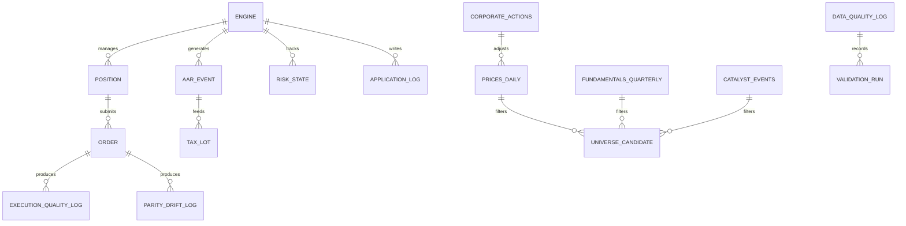
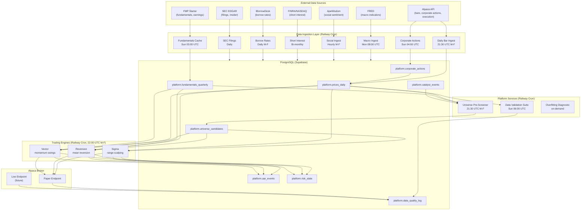

## 2. Database Schema

### 2.1 Entity-Relationship Diagram (Mermaid)

### 2.2 Detailed Table Definitions

List every table under the `platform` schema. For each, provide columns, types, constraints, and a one-line purpose.

#### `platform.prices_daily`

**Purpose:** Canonical daily OHLCV bars. Survivorship-free (Alpaca IEX free tier + Tradier pre-2020 merge). Backtests query directly; live engines query via `PostgresDataAdapter`.

**Columns:**

- `ticker` (text, PK): Stock symbol.
- `date` (date, PK): Trading day.
- `open`, `high`, `low`, `close` (numeric): Price bars.
- `volume` (bigint): Daily volume.
- `adjusted_close` (numeric): Split- and dividend-adjusted close.
- `delisted` (boolean, default false): True if the ticker was delisted.
- `delisting_date` (date, nullable): Date of delisting.
- `source` (text): `'alpaca'` or `'tradier'`.
- `recorded_at` (timestamptz, default `now()`): Ingestion timestamp.

**Indexes:** `(ticker, date)` unique; `(date)` for range scans.

**AI Rules:** Always filter `WHERE date >= start AND date <= end`. Never query without a date range.

#### `platform.fundamentals_quarterly`

**Purpose:** Point-in-time quarterly fundamentals (FMP Starter). Used by Reversion for earnings-quality gate and Vector for Gate 1 (P/B, D/E).

**Columns:**

- `ticker` (text, PK): Stock symbol.
- `filing_date` (date, PK): SEC filing date (PIT-safe boundary).
- `period_end_date` (date): Fiscal quarter end.
- `revenue`, `net_income`, `fcf` (numeric): Core financials.
- `total_assets`, `total_liabilities` (numeric): Balance sheet.
- `current_assets`, `current_liabilities` (numeric): Liquidity.
- `shares_outstanding` (numeric): For per-share calculations.
- `pb` (numeric, nullable): Computed price-to-book.
- `de` (numeric, nullable): Computed debt-to-equity.
- `recorded_at` (timestamptz, default `now()`).

**Indexes:** `(ticker, filing_date)` unique.

**AI Rules:** Always filter `WHERE filing_date <= :as_of_date` for point-in-time safety. Never use `period_end_date` alone for PIT queries.

#### `platform.corporate_actions`

**Purpose:** Splits and dividends from Alpaca's free `/v2/corporate_actions` endpoint. Applied to `prices_daily` weekly.

**Columns:**

- `ticker` (text): Stock symbol.
- `action_date` (date): Effective date.
- `action_type` (text): `'split'` or `'dividend'`.
- `ratio` (numeric): For splits, new/old (e.g., 4.0 for 4:1). For dividends, per-share amount.
- `raw_data` (jsonb): Full Alpaca response for audit.
- `recorded_at` (timestamptz, default `now()`).

**Indexes:** `(ticker, action_date, action_type)` unique.

#### `platform.catalyst_events`

**Purpose:** Earnings beats (FMP Starter). Used by Vector Gate 2 and future Catalyst engine.

**Columns:**

- `ticker` (text): Stock symbol.
- `event_date` (date): Earnings announcement date.
- `event_type` (text): `'EARNINGS_BEAT'` (only type for MVP).
- `magnitude_pct` (numeric): `(actual - estimated) / estimated`.
- `recorded_at` (timestamptz, default `now()`).

**Indexes:** `(ticker, event_date)` unique.

#### `platform.tradier_options_chains`

**Purpose:** Options chain snapshot from Tradier (May 2026). Frozen — parked for future S2 engine.

**Columns:**

- `ticker` (text): Underlying symbol.
- `expiration_date` (date): Option expiration.
- `strike` (numeric): Strike price.
- `option_type` (text): `'CALL'` or `'PUT'`.
- `bid`, `ask`, `last` (numeric): Quote data.
- `volume`, `open_interest` (integer): Activity.
- `retrieved_at` (timestamptz): Snapshot timestamp.

**AI Rules:** This table is frozen. Do not write to it.

#### `platform.universe_candidates` (planned — see §5 Implementation Queue)

**Purpose:** Pre-screened candidates per engine, refreshed daily. Engines read from this table instead of using hardcoded lists.

**Columns (planned):**

- `engine` (text, PK): `'sigma'`, `'reversion'`, `'vector'`.
- `ticker` (text, PK): Stock symbol.
- `as_of_date` (date, PK): Screening date.
- `score` (float): Engine-specific pre-screen score (0–100).
- `reason` (text): Human-readable rationale.

**Indexes:** `(engine, ticker, as_of_date)` unique; `(engine, as_of_date)` for scheduler reads.

#### `platform.aar_events`

**Purpose:** Unified after-action reports for every trade, paper or live. Fed by `tpcore.aar.AARWriter`.

**Columns:**

- `id` (uuid, PK): Unique row identifier.
- `engine` (text): `'sigma'`, `'reversion'`, `'vector'`.
- `trade_id` (text): Engine-assigned trade identifier.
- `ticker` (text): Stock symbol.
- `aar_data` (jsonb): Full `AfterActionReport` model serialized.
- `recorded_at` (timestamptz, default `now()`).

**Indexes:** `(engine, trade_id)` unique.

**AI Rules:** Use `INSERT ... ON CONFLICT (engine, trade_id) DO NOTHING`. The `aar_data` column is jsonb — query with `aar_data->>'field_name'`.

#### `platform.execution_quality_log`

**Purpose:** Fill quality per order. Populated by `tpcore.quality.ExecutionQualityWriter`.

**Columns:**

- `source` (text): `'execution_quality'`.
- `timestamp` (timestamptz).
- `slippage_bps` (numeric): Signed basis points (positive = unfavorable).
- `fill_price` (numeric): Actual fill price.
- `paper_or_live` (text): Execution environment.
- `notes` (jsonb): Full `ExecutionQualityScore` model.

#### `platform.data_quality_log`

**Purpose:** Multi-purpose quality log. Receives rows from the Data Validation Suite, execution quality tracker, and credibility scorer.

**Columns:**

- `source` (text): `'validation.delistings'`, `'validation.constituent'`, `'validation.splits'`, `'execution_quality'`, `'backtest_credibility.<engine>'`, `'quotes_crosscheck_tradier_alpaca'`.
- `timestamp` (timestamptz).
- `latency_ms` (integer): Check duration.
- `missing_bars` (integer): Repurposed — count of failures for validation checks.
- `stale` (boolean): True if the check failed.
- `confidence` (numeric): Fraction of entries that passed.
- `notes` (jsonb): Detailed failure list or diagnostic output.

#### `platform.parity_drift_log`

**Purpose:** Paper-vs-live fill drift. Populated by `LivePaperParityHarness` when a live broker is provisioned.

**Columns:**

- `client_order_id` (text): Order identifier.
- `paper_fill_price` (numeric): Paper fill.
- `live_fill_price` (numeric, nullable): Live fill (null until live broker active).
- `drift_bps` (numeric): Signed basis points.
- `paper_filled_at` (timestamptz): Paper fill timestamp.
- `live_filled_at` (timestamptz, nullable): Live fill timestamp.
- `timestamp` (timestamptz, default `now()`).

#### `platform.risk_state`

**Purpose:** Per-engine risk governor state. Persists daily/weekly P&L and kill-switch flag across Railway cron invocations.

**Columns:**

- `engine` (text, PK): `'sigma'`, `'reversion'`, `'vector'`.
- `daily_pnl` (numeric): Cumulative P&L for the current trading day.
- `weekly_pnl` (numeric): Cumulative P&L for the current trading week.
- `kill_switch_active` (boolean, default false): If true, engine refuses to submit orders.
- `kill_switch_reason` (text, nullable): Why the kill switch was tripped.
- `open_positions` (integer, default 0): Current position count.
- `last_updated` (timestamptz, default `now()`).

**AI Rules:** Always use `INSERT ... ON CONFLICT (engine) DO UPDATE`. Never delete rows from this table.

#### `platform.allocations` (stub)

**Purpose:** Future Allocator capital assignments. Schema deferred.

#### `platform.forensics_triggers` (stub)

**Purpose:** Future Forensics sprint triggers. Schema deferred.

#### `platform.tax_lots` (planned)

**Purpose:** FIFO tax lot tracking for the Tax Overlay. Schema deferred.

#### `platform.application_log` (planned — see §5)

**Purpose:** Permanent audit trail for every scheduler run. Replaces ephemeral Railway stdout logs.

**Columns (planned):**

- `id` (uuid, PK).
- `engine` (text): `'sigma'`, `'reversion'`, `'vector'`.
- `run_id` (uuid): Unique per scheduler invocation.
- `event_type` (text): `'STARTUP'`, `'SCAN_COMPLETE'`, `'SIGNAL'`, `'ORDER_SUBMITTED'`, `'FILL_CONFIRMED'`, `'ERROR'`, `'SHUTDOWN'`.
- `severity` (text): `'INFO'`, `'WARNING'`, `'ERROR'`, `'CRITICAL'`.
- `message` (text): Human-readable.
- `data` (jsonb): Structured payload.
- `recorded_at` (timestamptz, default `now()`).

**Indexes:** `(engine, run_id, recorded_at)`.

## 3. Dataflow Specification

### 3.1 System-Level Flow Diagram (Mermaid)

### 3.2 Ingestion Flow Detail

**Trigger:** Railway cron services fire on schedule. Each ingestion script is idempotent (re-running produces the same result).

- **Daily Bar Ingest (21:30 UTC Mon-Fri):** Pulls latest bars from Alpaca for all active tickers. Upserts into `platform.prices_daily`. Engines never call Alpaca for bars — they query this table via `PostgresDataAdapter`.
- **Corporate Actions (Sun 04:00 UTC):** Pulls split/dividend events from Alpaca → `platform.corporate_actions`. Applies adjustments to `platform.prices_daily` via `apply_splits.py`.
- **Fundamentals Cache Refresh (Sun 03:00 UTC):** Pulls latest quarterly filings from FMP → `platform.fundamentals_quarterly`. The `FundamentalsCache` wrapper serves engines with DB-first, FMP-fallback logic.
- **Macro Ingest (Mon 08:00 UTC):** Pulls Sahm Rule, PMI, claims, yield curve from FRED → `platform.macro_indicators`. Used by Sentinel engine (future).
- **Social Ingest (Hourly M-F):** Pulls Reddit/StockTwits sentiment from ApeWisdom → `platform.social_signals`. Used by S2 engine (future).
- **Short Interest (Bi-monthly):** Pulls FINRA/NASDAQ short interest data → `platform.short_interest`. PIT-safe: release-date matched.
- **Borrow Rates (Daily M-F):** Scrapes IBorrowDesk → `platform.borrow_rates`. Fragile; circuit breaker active.
- **SEC Filings (Daily):** Pulls 10-K, 10-Q, 8-K, Form 4 from SEC EDGAR → `platform.filings_insider`. Used by Vector catalyst detection and S2 insider check.

### 3.3 Engine Execution Flow

**Trigger:** Railway cron services fire at 22:00 UTC Mon-Fri, 30 minutes after the Universe Pre-Screener completes.

1. **Startup:** Scheduler creates asyncpg pool. Reads `platform.risk_state` for kill-switch status. Refuses to run if kill switch is active or database is unreachable.
2. **Universe Selection:** Queries `platform.universe_candidates WHERE engine = $1 AND as_of_date = CURRENT_DATE`. Falls back to hardcoded list if table is empty (transitional).
3. **Setup Detection:** Plug queries `platform.prices_daily` via `PostgresDataAdapter` for daily bars. Computes engine-specific scores. Returns ranked candidates.
4. **Lifecycle Analysis:** For each candidate above threshold, determines phase (SETUP, ACTIVE, EXHAUSTED). Applies engine-specific gates (earnings quality, CHOP, catalyst proximity).
5. **Execution & Risk:** Computes position size. Calls `RiskGovernor.check_trade()`. Submits bracket orders to Alpaca paper endpoint. Records fill quality.
6. **AAR Logging:** On Tier 1 and Tier 2 fills, writes `AfterActionReport` to `platform.aar_events` via `AARWriter`.
7. **Shutdown:** Updates `platform.risk_state` with cumulative P&L. Pings Healthchecks. Closes pool. Exits.

### 3.4 Backtesting Flow

- **Data Loading:** Reads `platform.prices_daily`, `platform.fundamentals_quarterly`, `platform.catalyst_events`, `platform.corporate_actions` directly. No external APIs.
- **Trade Simulation:** Identical engine logic. Fills simulated at next open. Transaction cost model: 0.05% slippage per side.
- **Output:** Per-trade CSV → `backtests/<engine>_trades.csv`. Overfitting report → `backtests/<engine>_overfitting_report.json`. Credibility score → `platform.data_quality_log`.

## 4. AI Implementation Rules

This section is binding for all AI coding sessions. Violating any rule is a hard failure.

### 4.1 Data Access

- **Source of truth:** `platform.prices_daily` is the sole source of price data for all engines and backtests. Never call Alpaca, FMP, or any external API for bars from within an engine or backtest script.
- **Point-in-time:** All fundamental queries must filter `WHERE filing_date <= :as_of_date`. Never use `period_end_date` alone.
- **Fail-closed:** If the database is unreachable, the engine must halt with a critical log and non-zero exit. No silent fallback to external APIs.
- **Idempotency:** All writes use `INSERT ... ON CONFLICT DO NOTHING` or `ON CONFLICT DO UPDATE`. Every ingestion script is safe to re-run.

### 4.2 Schema

- **No new tables without an Alembic migration.** All migrations live in `platform/migrations/versions/`.
- **All timestamps are `timestamptz` in UTC.** Application code must use `datetime.now(UTC)`.
- **Money is `Decimal`, quantities are `int`.** Never `float` for prices, sizes, or P&L in production code. Backtest scripts are exempt.
- **Every table has a `recorded_at` column** defaulting to `now()` for audit trails.

### 4.3 Performance

- **Batch queries:** When scanning multiple tickers, use `WHERE ticker = ANY($1::text[])` with a list parameter — never a loop of individual queries.
- **Date ranges are mandatory:** Every query against `prices_daily` must include `WHERE date >= $1 AND date <= $2`. Full table scans are prohibited.
- **Connection pools:** Schedulers create one pool at startup and reuse it for the entire run. The pool is closed before exit. No connection leaks.

### 4.4 Security

- **Secrets are never hardcoded.** All credentials come from environment variables (`.env` locally, Railway dashboard in production).
- **No raw text storage.** Reddit/StockTwits text is purged after analysis. Only summary metrics are persisted.
- **Personal-use scope.** The platform protects one operator. Multi-operator or commercial use is blocked.

### 4.5 Naming

- **Engine names:** `sigma`, `reversion`, `vector`, `s2`, `catalyst`, `sentinel`. No deprecated names (Creeper, Swinger, Grifter, Fader).
- **Score names:** `sigma_score` (or `fade_score` for Reversion, `swing_score` for Vector, `squeeze_score` for S2).
- **Database schemas:** All operational tables are in the `platform` schema. Alembic tracks migrations in `platform` schema.
- **File naming:** Backtest scripts at `<engine>/backtest.py`. Plugs at `<engine>/plugs/<plug_name>.py`. Tests at `<engine>/tests/test_<module>.py`.

### 4.6 Error Handling

- **Fail loud.** Never `except Exception: pass`. Log the error, increment the outage counter, and exit non-zero if the error is critical.
- **Circuit breakers:** For external API calls (FMP, IBorrowDesk, ApeWisdom), 5 consecutive failures trigger a 6-hour pause.
- **Healthchecks ping on every run.** Success = ping. Failure = `/fail` ping. No ping = alert.

## 5. Implementation Queue

Tables and services that are specified but not yet built:

| Priority | Component | Status |
| ---: | --- | --- |
| 1 | `PostgresDataAdapter` | Not built — engines currently hit Alpaca live for bars |
| 2 | `platform.universe_candidates` + Universe Pre-Screener | Not built — engines use hardcoded lists |
| 3 | `platform.application_log` + DB log handler | Not built — logs are ephemeral stdout |
| 4 | Daily bar ingestion cron | Not built — bars not pre-fetched to `prices_daily` |
| 5 | Fundamentals cache weekly refresh | Not built — cache is lazy (on scan miss) |
| 6 | `platform.macro_indicators` + FRED adapter | Not built |
| 7 | `platform.social_signals` + ApeWisdom adapter | Not built |
| 8 | `platform.short_interest` + FINRA adapter | Not built |
| 9 | `platform.borrow_rates` + IBorrowDesk adapter | Not built |
| 10 | `platform.filings_insider` + SEC EDGAR adapter | Not built |
| 11 | `platform.tax_lots` + Tax Overlay | Schema deferred |
